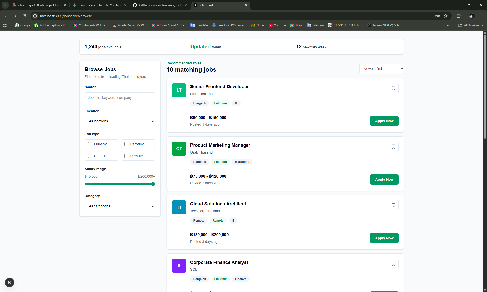
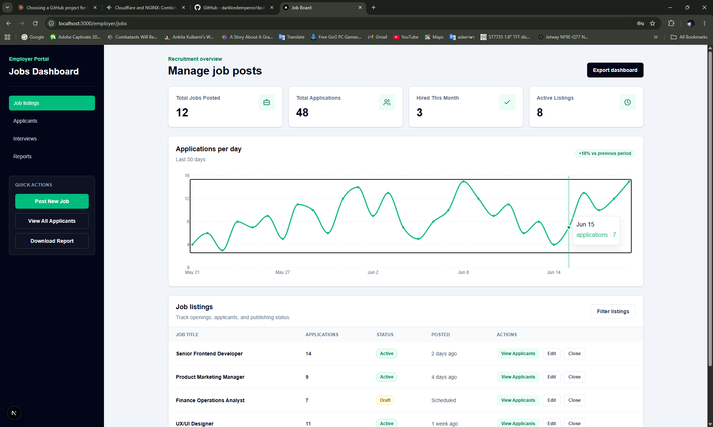
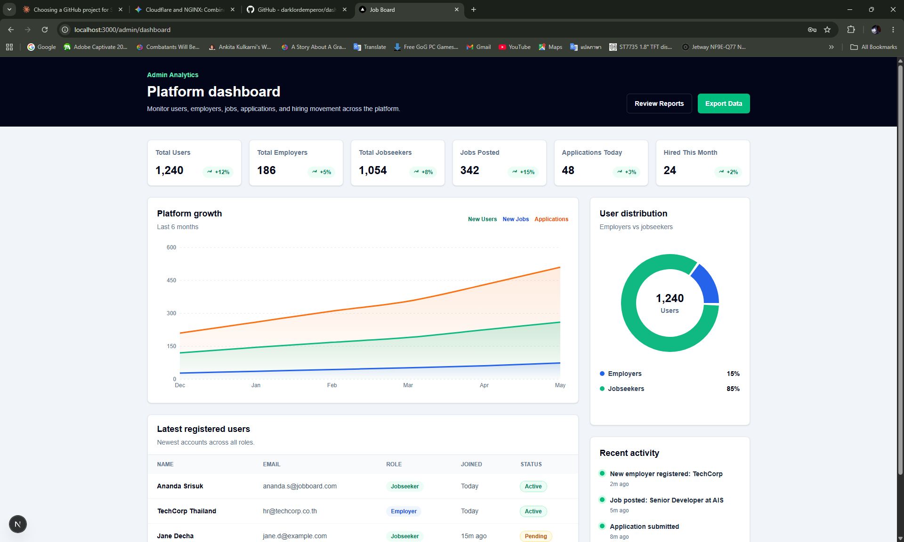

# Job Board Frontend

Next.js frontend for a Job Board application backed by a Laravel 13 REST API. The app uses Laravel Sanctum SPA authentication with cookie-based sessions, not JWT tokens.

## Tech Stack

- Next.js App Router with TypeScript
- React 19
- Tailwind CSS
- Axios with interceptors
- Zustand for auth state
- React Hook Form and Zod for forms
- Recharts for dashboard visualizations
- Docker Compose for local full-stack development

> Note: this repository currently uses `next@16.2.6`. Next's bundled docs mark `middleware.ts` as deprecated in favor of `proxy.ts`, so route protection is implemented in `src/proxy.ts`.

## Backend

The frontend expects the Laravel API project at:

```text
C:\dashboard-api
```

Default host API URL:

```text
http://localhost:8000
```

Browser requests are sent through Next.js rewrites, so frontend code calls relative URLs such as `/api/v1/auth/login` and `/sanctum/csrf-cookie`. In Docker, Next.js proxies those requests to `http://laravel-api:80`.

Required Laravel endpoints:

- `GET /sanctum/csrf-cookie`
- `POST /api/v1/auth/login`
- `POST /api/v1/auth/logout`
- `GET /api/v1/auth/me`

## Auth Flow

Login follows the Sanctum SPA sequence:

1. `GET /sanctum/csrf-cookie`
2. `POST /api/v1/auth/login`
3. `GET /api/v1/auth/me`
4. Save the authenticated user in Zustand
5. Redirect users by role:
   - `admin` -> `/admin/dashboard`
   - `employer` -> `/employer/jobs`
   - `jobseeker` -> `/jobseeker/browse`

Protected routes are guarded in `src/proxy.ts` by checking for the Laravel session cookie, `job_board_session`. Unauthenticated requests to `/admin/*`, `/dashboard/*`, `/employer/*`, or `/jobseeker/*` are redirected to `/login?next=...`.

Next.js rewrites are configured in `next.config.ts`:

- `/api/:path*` -> `http://laravel-api:80/api/:path*`
- `/sanctum/:path*` -> `http://laravel-api:80/sanctum/:path*`

Axios is configured in `src/lib/axios.ts` with:

- `baseURL: "/"`
- `withCredentials: true`
- `withXSRFToken: true`
- `X-Requested-With: XMLHttpRequest`
- `401` auth clear and redirect to `/login`
- `422` validation error extraction
- `500+` generic error toast

## Environment

Create a local env file from the example:

```powershell
copy .env.example .env.local
```

Current example values:

```env
NEXT_PUBLIC_API_URL=
NEXT_INTERNAL_API_URL=http://laravel-api:80
NEXT_TELEMETRY_DISABLED=1
```

For Docker, `.env.docker` is already included:

```env
NEXT_PUBLIC_API_URL=
NEXT_INTERNAL_API_URL=http://laravel-api:80
NEXT_TELEMETRY_DISABLED=1
WATCHPACK_POLLING=true
CHOKIDAR_USEPOLLING=true
```

`NEXT_PUBLIC_API_URL` is intentionally blank in local env files because Axios uses same-origin relative URLs through Next rewrites. `NEXT_INTERNAL_API_URL` documents the Docker-internal Laravel address for environments that need server-side API calls; the current auth guard in `src/proxy.ts` only checks for the Laravel session cookie.

## Local Development

Install dependencies:

```powershell
npm install
```

Run the frontend:

```powershell
npm run dev
```

Open:

```text
http://localhost:3000
```

The root route redirects to `/login`.

## Current Pages

- `/login`: Sanctum login form with role-aware post-login redirect.
- `/register`: account registration form.
- `/jobseeker/browse`: interactive job browsing page with keyword, location, job type, salary, category, and bookmark UI.
- `/employer/jobs`: employer jobs dashboard with job stats, Recharts applications line chart, job listing table, and quick actions.
- `/admin/dashboard`: admin analytics dashboard with platform stats, Recharts growth area chart, user distribution pie chart, latest users table, and recent activity feed.

The dashboard chart components are loaded client-side with `next/dynamic({ ssr: false })` because Recharts needs browser layout dimensions for responsive charts.

## UI Preview

The current dashboard UI screenshots are stored in `public/UI/`.

### Jobseeker Browse



### Employer Jobs



### Admin Dashboard



## Docker Development

Docker Compose is owned by the Laravel project at `C:\dashboard-api\docker-compose.yml`.
It runs:

- `laravel-api`: PHP 8.3-FPM + Nginx on port `8000`
- `nextjs-app`: Node 20 on port `3000`
- `mysql`: MySQL 8.0 with persistent volume
- `redis`: Redis 7 for cache and queues
- `mailpit`: email testing, UI on port `8025`

Run the full stack:

```powershell
cd C:\dashboard-api
docker compose up --build
```

Useful URLs:

- Frontend: `http://localhost:3000`
- Laravel API: `http://localhost:8000`
- Mailpit: `http://localhost:8025`

Both Laravel and Next.js source folders are bind-mounted for hot reload in development.

## Project Structure

```text
src/
  app/
    (auth)/
      login/page.tsx
      register/page.tsx
    (dashboard)/
      admin/dashboard/page.tsx
      employer/jobs/page.tsx
      jobseeker/browse/page.tsx
    layout.tsx
    page.tsx
  components/
    ClientEventBridge.tsx
  hooks/
    useAuth.ts
  lib/
    auth.ts
    axios.ts
    client-events.ts
  store/
    authStore.ts
  types/
    api.types.ts
  proxy.ts
```

## Important Files

- `src/lib/axios.ts`: shared Axios instance and API error handling
- `src/lib/auth.ts`: Sanctum auth API helpers
- `src/store/authStore.ts`: Zustand auth state
- `src/hooks/useAuth.ts`: public auth hook for UI components
- `src/proxy.ts`: cookie-based protected route guard for admin, employer, and jobseeker pages
- `src/types/api.types.ts`: shared API interfaces
- `src/app/(auth)/login/page.tsx`: login form and role redirect mapping
- `src/app/(dashboard)/jobseeker/browse/page.tsx`: jobseeker browsing UI
- `src/app/(dashboard)/employer/jobs/page.tsx`: employer jobs dashboard with Recharts line chart
- `src/app/(dashboard)/admin/dashboard/page.tsx`: admin analytics dashboard with Recharts area and pie charts

## API Types

Shared TypeScript response models live in `src/types/api.types.ts`:

- `ApiResponse<T>`
- `User`
- `Job`
- `Application`
- `ValidationErrors`

Expected API wrapper:

```ts
{
  success: boolean;
  data: T;
  message: string;
  errors: Record<string, string[]> | null;
}
```

## Scripts

```powershell
npm run dev
npm run build
npm run start
npm run lint
```

Use `npm.cmd` on Windows PowerShell if the `.ps1` shim is blocked:

```powershell
npm.cmd run lint
npm.cmd run build
```

## Verification

Before pushing changes:

```powershell
npm run lint
npm run build
cd C:\dashboard-api
docker compose config --quiet
```

Latest verified commands:

```powershell
npm.cmd run lint
npm.cmd run build
```

`npm install recharts` reported `2 moderate` audit findings. They were not auto-fixed because `npm audit fix --force` can introduce breaking dependency changes.

## AI Disclosure

This project was scaffolded and iterated with AI assistance. The generated code was reviewed through linting and production build checks.
